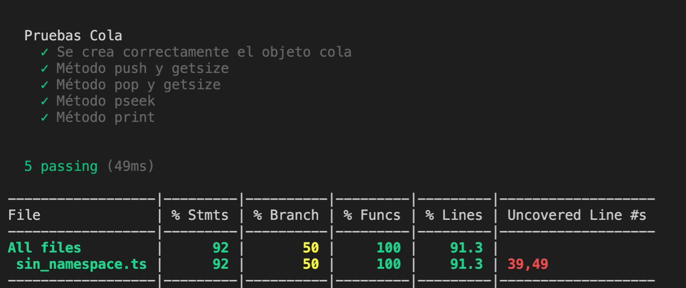

---
# Feel free to add content and custom Front Matter to this file.
# To modify the layout, see https://jekyllrb.com/docs/themes/#overriding-theme-defaults

layout: default
---

# DSI 2021: Práctica 7 MOD

## Descripción de la práctica

Desarrolle los siguientes ejercicios en su proyecto TypeScript asociado a la práctica y empuje los cambios al repositorio GitHub correspondiente, una vez haya finalizado:
Utilice un espacio de nombre para generar una FIFO con los métodos 
push. Añade un elemento a la cola
pop. Extrae el primer elemento insertado en la cola.
pseek. Devuelve el primer elemento insertado en la cola sin extraerlo.
size. Devuelve el número de elementos que contiene la cola.
print. Visualiza el contenido de la cola.
La cola, podrá ser de cualquier tipo de datos, string, number, boolean, etc....

Recuerde que deberá incluir la documentación haciendo uso de TypeDoc, así como seguir una metodología TDD/BDD utilizando el framework de pruebas Mocha y la librería de aserciones Chai. También trate de comprobar el nivel de cubrimiento de su código mediante Instanbul, así como hacer un seguimiento de dicho cubrimiento con Coveralls. Como entrega de esta tarea deberá indicar, de nuevo, el enlace a dicho repositorio GitHub con los ejercicios solicitados.

## Desarrollo

### Prerrequisitos: Instalación y configuración de Istanbul y Coveralls

Para la realización de la práctica, se ha usado el espacio de nombres `estructuras` para las clases, y el código se ha desarrollado en tres ficheros. El fichero `estructura.ts`contiene `Estructura` que implementa una clase genérica de estructura de datos:

```typescript

namespace estructuras {

export class Estructura<T> {
    protected data: T[];
    protected size: number;
    protected readonly maxSize: number;
    
    public constructor(maxLong: number) {

        this.size = 0;
        this.maxSize = maxLong;
        this.data = new Array<T>(this.maxSize);
    
    }

    public getSize(): number {
        let counter: number = 0;
        for (let i=0; i<this.size; i++){
            if (this.data[i] !== null)
                counter++;
        } 
        
        return counter;

    }

    public print(): string {
        return this.data.join(', ');
        };
    }
}
```

Otro `Cola` que implementa los métodos específicos de la clase `Cola`:

```typescript
/// <reference path="estructura.ts"/>

namespace estructuras {

export class Cola extends Estructura<number> {
        
        constructor(maxSize:number) {
            super(maxSize)
        } 

        public push(item: number) {
            if (this.size === this.maxSize ) {
                throw new Error('Error, cola llena');
            } 
            else {
                this.data[this.size++] = item; 
            }
        }
        
    
        public pop(): number {
            if (this.size === 0 ) {
                throw new Error('Error, cola vacía');
            }
            const item = this.data[0];    
            
            for (let i = 0; i < this.size; i++) {
                this.data[i] = this.data[i+1];
            }
            this.size--;
            return item;
        }

        public pseek(): number {
            return this.data[0];
        }
    }
}
```
Y el fichero de pruebas `index.ts` contiene un pequeño ejemplo para comprobar que la clase `Cola`funciona correctamente:

```typescript
/// <reference path="estructura.ts"/>
/// <reference path="cola.ts"/>

namespace estructuras {

    let cola1 = new Cola(10);
    cola1.push(10);
    cola1.push(20);
    cola1.push(30);
    cola1.print();
    console.log(cola1.getSize());
    cola1.pop();
    cola1.pop();
    console.log(cola1.getSize());
    cola1.print();
    cola1.push(40);
    cola1.push(50);
    console.log(cola1.getSize());
    cola1.print();
    console.log(cola1.pseek());
}
```

Para poder realizar los test con Mocha he tenido que meter el código en un sólo fichero `sin_namespaces.ts`, puesto que me estaba dando errores de importación al intentar ejecutar Mocha con el namespace y no he podido resolverlos en el plazo de realización de la práctica. Los test realizados son: 

```javascript
import 'mocha';
import {expect} from 'chai';
import {Cola} from '../src/sin_namespace';

describe('Pruebas Cola', () => {
    
    let cola1 = new Cola(10); 
    it("Se crea correctamente el objeto cola", () => {
        expect(cola1).to.exist;
        expect(cola1).to.be.an.instanceOf(Cola);
    });
    it("Método push y getsize", () => {
        expect(cola1.getSize()).to.be.equal(0);
        cola1.push(10);
        cola1.push(20);
        expect(cola1.getSize()).to.be.equal(2);
        cola1.pop();
        cola1.pop();
    });
    it("Método pop y getsize", () => {
        cola1.push(10);
        cola1.push(20);
        expect(cola1.getSize()).to.be.equal(2);
        cola1.pop();
        expect(cola1.getSize()).to.be.equal(1);
        cola1.pop();
        expect(cola1.getSize()).to.be.equal(0);
    });
    it("Método pseek", () => {
        cola1.push(10);
        cola1.push(20);
        cola1.push(30);
        expect(cola1.pseek()).to.be.equal(10);
        cola1.pop();
        expect(cola1.pseek()).to.be.equal(20);
        cola1.pop();
        cola1.pop();
    });
    it("Método print", () => {
        cola1.push(10);
        cola1.push(20);
        cola1.push(30);
        expect(cola1.print()).to.be.equal("10, 20, 30, , , , , , , ");
        cola1.pop();
        expect(cola1.print()).to.be.equal("20, 30, , , , , , , , ");
    });

});
```

Las estadísticas de cubrimiento del código son:



Falta por cubrir las líneas 39 y 49, que se refieren a los errores lanzados por el método push y pop si se intentan ejecutar cuando la lista está llena o vacía respectivamente.